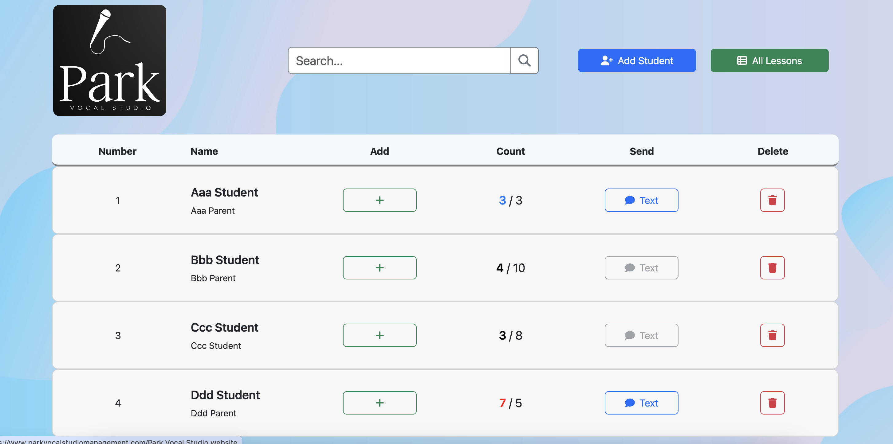

# Payment Reminder

[Payment Reminder](https://parkvocalstudiomanagement.com/)

The Payment Reminder App is a monorepo designed to help vocal coaches (e.g. Park Vocal Studio) manage vocal lessons, organize students, track payments, and send SMS reminders easily.

 

 

 

## Prerequisites

1. Node.js & npm
* Node.js is a JavaScript runtime used for the backend server.
* npm (Node Package Manager) is used for managing dependencies.
* [Download and install Node.js and npm.](https://nodejs.org/en)
 

2. Docker & docker-compose
* Docker is used for containerizing MySQL.
* [Download Docker.](https://www.docker.com/products/docker-desktop/)
* [Install Docker Compose.](https://docs.docker.com/compose/install/)
 

3. Environment variables for server
* MySQL DB Config (host, user, password, database, port).
* Twilio Account SID.
* Twilio Auth Token.
* Twilio Phone Number.
* Bcrypt Salt Rounds.
* JWT Secret.
* Encryption Key.
* Encryption IV.
* Max Login Attempts.
* Domain names for CORS.

 

## Getting Started

Follow these instructions to set up and run the Payment Reminder App locally.

1. Clone the Repository

`git clone https://github.com/elliotpark410/payment_reminder.git`
 

2. Setting up the Server

`cd server`

`npm install`

`npm run init-db` (Initializes Dockerized MySQL)

`npm run start-dev`
 

3. Setting up the Frontend

`cd payment_reminder_react`

`npm install`

`npm run start`
 

## Technologies Used

* React: For building the user interface.
* JavaScript: The main programming language for the frontend.
* TypeScript: For type safety and better developer experience.
* CSS: For custom styling
* Node.js: For the backend server.
* Express: A web framework for Node.js.
* Docker: To containerize MySQL.
* MySQL: The database used for storing application data.
* Postman: For API testing.
* dBeaver: For database visualization and management.
* AWS EC2 Linux: For hosting the backend server.
* AWS Amplify: For hosting the frontend application.
* Twilio: For SMS delivery.
* Namecheap: For domain registration and DNS management.
* Let's Encrypt: For SSL Certification.
* dotenv: For environment variables.

 

## Author

Github: [https://github.com/elliotpark410](https://github.com/elliotpark410)
 

LinkedIn: [https://www.linkedin.com/in/elliot-park/](https://www.linkedin.com/in/elliot-park/)
 

Email: [elliotpark410@gmail.com](mailto:elliotpark410@gmail.com)
 

## License

This project is licensed under the MIT License. See the LICENSE file for details.
